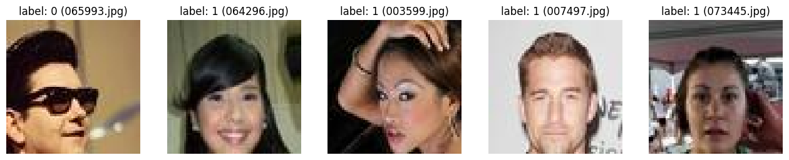
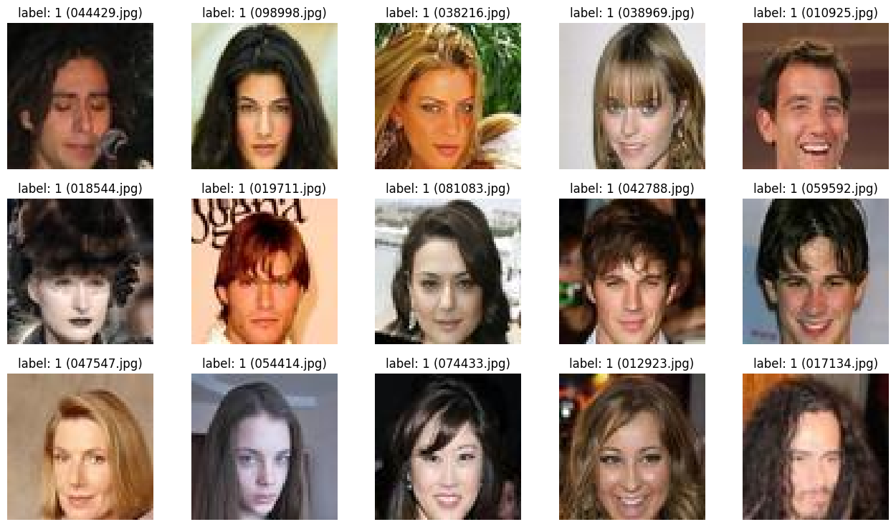
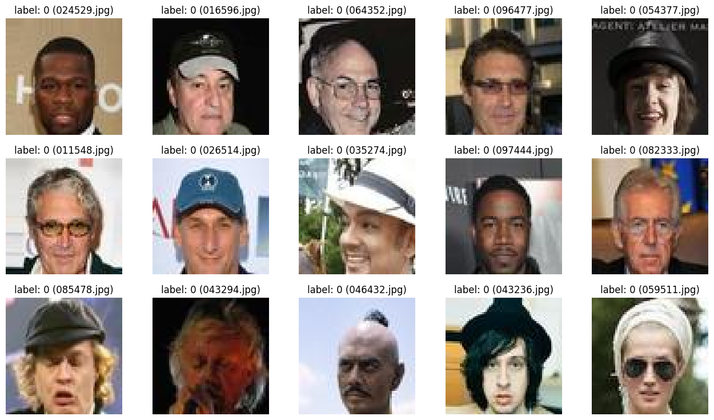
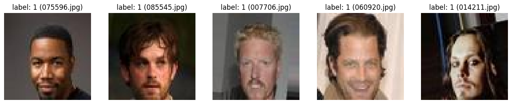
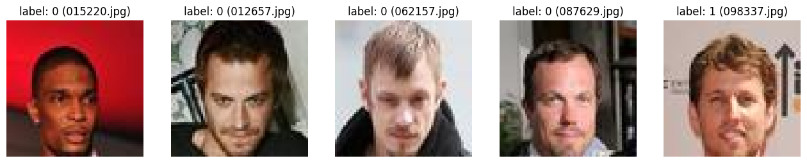
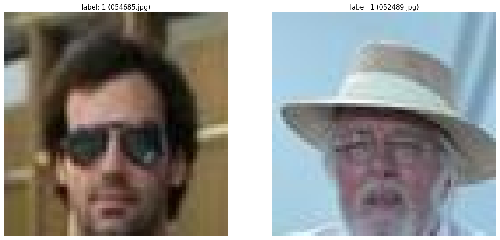
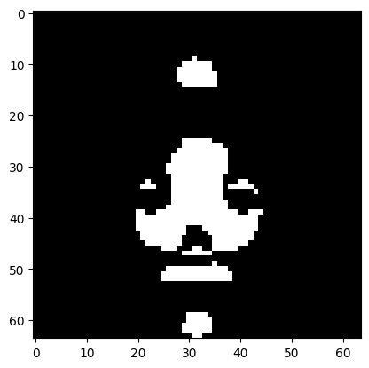

```python
%load_ext autoreload
%autoreload 2
```

    The autoreload extension is already loaded. To reload it, use:
      %reload_ext autoreload


# Le problème

On dispose d'un jeu d'entrainement constitué de 100000 images de taille 64x64, séparées en deux classes (0 et 1). L'objectif est de mettre au point un modèle de classification.  

## Exploration des données

On charge le jeu de données dans un dataframe contenant les chemins d'accès aux images et les labels correspondant


```python
from pathlib import Path

from thera_panacea.etl.extract import extract_to_df


data_root_dir = Path("data")
train_img_dir = data_root_dir / "train_img"
label_file = data_root_dir / "label_train.txt"

df = extract_to_df(train_img_dir, label_file)
df.head()
```


<div>
<style scoped>
    .dataframe tbody tr th:only-of-type {
        vertical-align: middle;
    }

    .dataframe tbody tr th {
        vertical-align: top;
    }

    .dataframe thead th {
        text-align: right;
    }
</style>
<table border="1" class="dataframe">
  <thead>
    <tr style="text-align: right;">
      <th></th>
      <th>path</th>
      <th>label</th>
    </tr>
  </thead>
  <tbody>
    <tr>
      <th>0</th>
      <td>data/train_img/000001.jpg</td>
      <td>1</td>
    </tr>
    <tr>
      <th>1</th>
      <td>data/train_img/000002.jpg</td>
      <td>1</td>
    </tr>
    <tr>
      <th>2</th>
      <td>data/train_img/000003.jpg</td>
      <td>1</td>
    </tr>
    <tr>
      <th>3</th>
      <td>data/train_img/000004.jpg</td>
      <td>1</td>
    </tr>
    <tr>
      <th>4</th>
      <td>data/train_img/000005.jpg</td>
      <td>1</td>
    </tr>
  </tbody>
</table>
</div>


On note que le jeu de données est déséquilibré avec un peu moins de 4 fois plus de labels 1 que 0.

Voici un aperçu des images auxquelles le modèle devra assigner un label


```python
from thera_panacea.etl.visualize import visualize_sample


visualize_sample(df, n_rows=1)
```


    

    


Le critère selon lequel un label est affecté à une image n'est pas connu a priori mais une visualisation selon chaque classe donne quelques indices.


```python
positive_df = df[df["label"] == 1]
visualize_sample(positive_df)
```


    

    


```python
negative_df = df[df["label"] == 0]
visualize_sample(negative_df)
```


    

    


Il semble à première vue que les visage affublés d'un chapeau, d'une paire de lunette ou encore d'une barbe soit labélisés 0. Le critère des lunettes ou des chapeaux apparaît assez clairement, ce qui est moins le cas pour la barbe (ou la moustache). 


```python
from matplotlib import pyplot as plt
from PIL import Image


ambiguous_positive_df = df.loc[[75595, 85544, 7705, 60919, 14210, ]]
visualize_sample(ambiguous_positive_df, n_rows=1)

ambiguous_negative_df = df.loc[[15219, 12656, 62156, 87628, 98336]]
visualize_sample(ambiguous_negative_df, n_rows=1)
```


    

    


    

    


Ma conclusion est alors que soit les barbes et moustaches ne sont pas déterminantes et dans ce cas le critère qui distingue ces deux séries d'exemples m'échappe, soit ce sont bien des critères et alors il y a dans le jeu de données des images mal labellisées.

D'ailleurs on peut trouver des images avec chapeau ou lunettes qui elles aussi sont mal labelisées.


```python
mislabelled_imgs = df.loc[[54684, 52488]]
visualize_sample(mislabelled_imgs, 1, 2)
```


    

    


## Détermination du critère de classification

Le traitement qui suit permet de se convaincre que l'on est probablement dans le second cas. 

L'idée ici est d'effectuer un SelectPercentile sur le jeu d'image afin de récupérer les pixels les plus signifiants relativement aux labels correspondant.

Pour des raisons de temps de calcul, on se limite à un échantillon contenant des versions noir et blanc des images.


```python
from thera_panacea.etl.transform import df_to_arrays


sample_df = df.sample(30000)
X, y = df_to_arrays(sample_df)
```

      0%|          | 0/30000 [00:00<?, ?it/s]100%|██████████| 30000/30000 [00:18<00:00, 1630.89it/s]


```python
from sklearn.feature_selection import SelectPercentile


sp = SelectPercentile().fit(X, y)
mask = sp.get_support().reshape(64, 64)

plt.imshow(mask, cmap="gray")
```


    <matplotlib.image.AxesImage at 0x7f68b7813be0>


    

    


Sur cette image, on constate que les pixels d'intérêt se trouvent au dessus de la tête (chapeau?), dans la zone du visage autour des yeux (lunettes?), au dessus et en dessous de la bouche (barbe, moustache?). On fera donc l'hypothèse que ce sont bien ces critères qui déterminent la classe d'une image.

# Stratégie

La question du déséquilibre des données pourra se traiter via un rééchantillonage ou bien en jouant sur les poids dans les fonctions de pertes utilisées.

Le problème délicat à traiter est celui des images mal labelisées. Il est clair qu'il y en a un certain nombre et qu'il n'est pas question de corriger à la main les 100000 labels. 

Pour résoudre ce problème, on va dans un premier temps mettre au point un modèle "suffisament" performant qui s'entrainera sur le jeu de données en l'état. Ensuite on utilisera la librairie [Link CleanLab Here](https://github.com/cleanlab/cleanlab) pour repérer les éventuelles erreurs de labelisation en se basant sur le résultats du modèle.

Ces données seront alors écartées et on pourra vérifier si cela a un effet bénéfique sur les résultats que donne le même modèle sur ce jeu de données modifié.

Enfin, on pourra terminer en utilisant une architecture de modèle plus complexe en espérant obtenir d'encore meilleurs résultats.

# Modèle de base


```python

```
