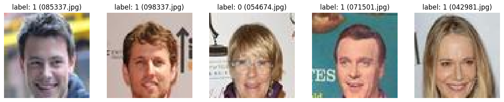
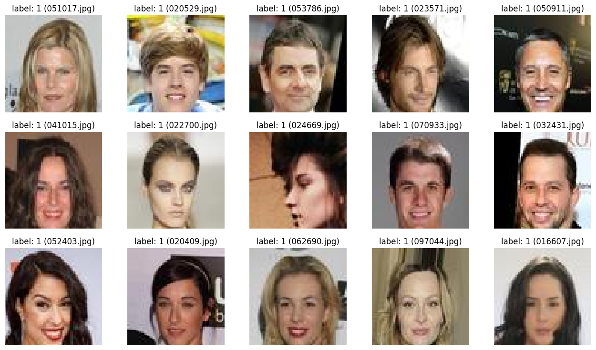
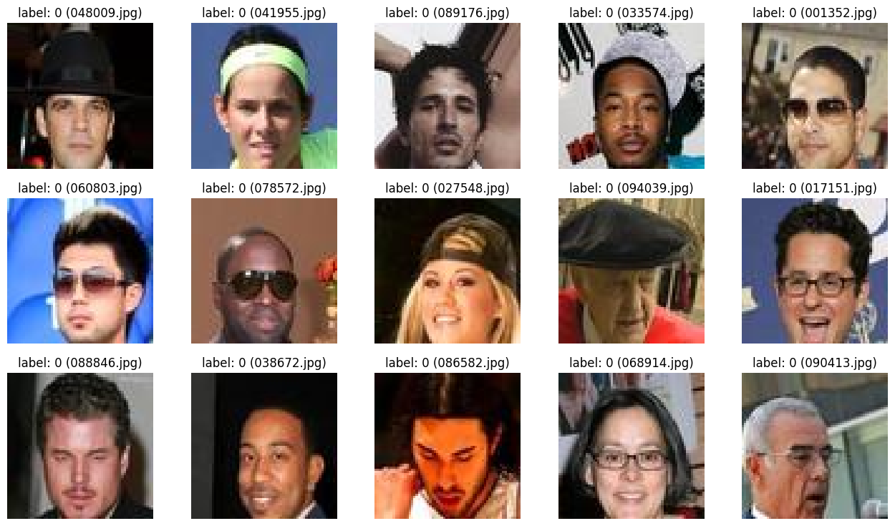
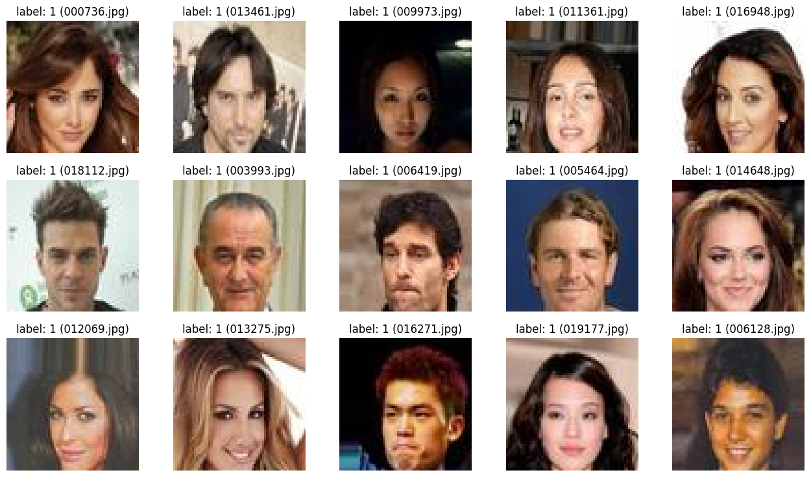
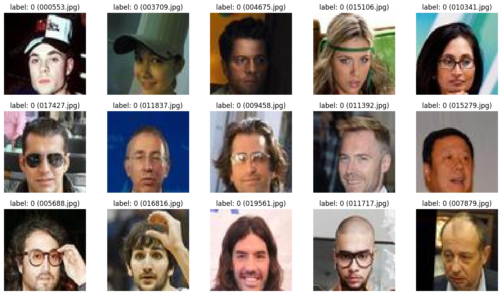

# Le problème

On dispose d'un jeu d'entrainement constitué de 100000 images de taille 64x64, séparées en deux classes (0 et 1). L'objectif est de mettre au point un modèle de classification.  

## Exploration des données

On charge le jeu de données dans un dataframe contenant les chemins d'accès aux images et les labels correspondants


```python
from pathlib import Path

from thera_panacea.etl.extract import extract_to_df


data_root_dir = Path("data")
train_img_dir = data_root_dir / "train_img"
label_file = data_root_dir / "label_train.txt"

df = extract_to_df(train_img_dir, label_file)
display(df.head())
```


<div>
<style scoped>
    .dataframe tbody tr th:only-of-type {
        vertical-align: middle;
    }

    .dataframe tbody tr th {
        vertical-align: top;
    }

    .dataframe thead th {
        text-align: right;
    }
</style>
<table border="1" class="dataframe">
  <thead>
    <tr style="text-align: right;">
      <th></th>
      <th>path</th>
      <th>label</th>
    </tr>
  </thead>
  <tbody>
    <tr>
      <th>0</th>
      <td>data/train_img/000001.jpg</td>
      <td>1</td>
    </tr>
    <tr>
      <th>1</th>
      <td>data/train_img/000002.jpg</td>
      <td>1</td>
    </tr>
    <tr>
      <th>2</th>
      <td>data/train_img/000003.jpg</td>
      <td>1</td>
    </tr>
    <tr>
      <th>3</th>
      <td>data/train_img/000004.jpg</td>
      <td>1</td>
    </tr>
    <tr>
      <th>4</th>
      <td>data/train_img/000005.jpg</td>
      <td>1</td>
    </tr>
  </tbody>
</table>
</div>


On note que le jeu de données est déséquilibré avec environ 87% de labels 1.

Voici un aperçu des images auxquelles le modèle devra assigner un label


```python
from thera_panacea.visualize.visualize import visualize_sample

df.head()
visualize_sample(df, n_rows=1)
```


    

    


Le critère selon lequel un label est affecté à une image n'est pas connu a priori mais une visualisation selon chaque classe donne quelques indices.


```python
positive_df = df[df["label"] == 1]
visualize_sample(positive_df)
```


    

    


```python
negative_df = df[df["label"] == 0]
visualize_sample(negative_df)
```


    

    


Il semble à première vue que les visage affublés d'un chapeau, d'une paire de lunettes ou encore d'une barbe/moustache soient labélisés 0. Le critère des lunettes ou des chapeaux apparaît assez clairement, ce qui est moins le cas pour la barbe (ou la moustache) comme l'illustrent les exemples ci-dessous.


```python
ambiguous_positive_df = df.loc[[75595, 85544, 7705, 60919, 14210, ]]
visualize_sample(ambiguous_positive_df, n_rows=1)

ambiguous_negative_df = df.loc[[15219, 12656, 62156, 87628, 98336]]
visualize_sample(ambiguous_negative_df, n_rows=1)
```


    

    


    

    


Ma conclusion est alors que soit les barbes et moustaches ne sont pas déterminantes et dans ce cas le critère qui distingue ces deux séries d'exemples m'échappe, soit ce sont bien des critères et alors il y a dans le jeu de données des images mal labellisées.

D'ailleurs on peut trouver des images avec chapeau ou lunettes qui elles aussi sont mal labelisées.


```python
mislabelled_imgs = df.loc[[54684, 52488]]
visualize_sample(mislabelled_imgs, 1, 2)
```


    

    


## Détermination du critère de classification

Le traitement qui suit permet de se convaincre que l'on est probablement dans le second cas. 

L'idée ici est d'effectuer un SelectPercentile sur le jeu d'image afin de récupérer les pixels les plus signifiants relativement aux labels correspondant.

Pour des raisons de temps de calcul, on se limite à un échantillon contenant des versions noir et blanc des images.


```python
from thera_panacea.etl.transform import df_to_arrays


sample_df = df.sample(30000)
X, y = df_to_arrays(sample_df)
```


```python
from matplotlib import pyplot as plt
from sklearn.feature_selection import SelectPercentile


sp = SelectPercentile().fit(X, y)
mask = sp.get_support().reshape(64, 64)

plt.imshow(mask, cmap="gray")
```


    <matplotlib.image.AxesImage at 0x7f68b7813be0>


    

    


Sur cette image, on constate que les pixels d'intérêt se trouvent au dessus de la tête (chapeau?), dans la zone du visage autour des yeux (lunettes?), au dessus et en dessous de la bouche (barbe, moustache?). On fera donc l'hypothèse que ce sont bien ces critères qui déterminent la classe d'une image.

# Stratégie

La question du déséquilibre des données pourra se traiter via un rééchantillonage ou bien en jouant sur les poids dans les fonctions de pertes utilisées.

Le problème délicat à traiter est celui des images mal labelisées. Il est clair qu'il y en a un certain nombre et qu'il n'est pas question de corriger à la main les 100000 labels. 

Pour résoudre ce problème, on va dans un premier temps mettre au point un modèle "suffisament" performant qui s'entrainera sur le jeu de données en l'état. Ensuite on utilisera la librairie [CleanLab](https://github.com/cleanlab/cleanlab) pour repérer les éventuelles erreurs de labelisation en se basant sur les résultats du modèle.

Ces données seront alors écartées et on pourra vérifier si cela a un effet bénéfique sur les résultats que donne le même modèle sur ce jeu de données modifié.

Enfin, on pourrait aller plus loin avec des moyens de calcul suffisant en utilisant une architecture de modèle plus complexe en espérant obtenir d'encore meilleurs résultats.

## Modèle de base


```python
import torch

from thera_panacea.model.baseline_model import BaselineModel


device = "cuda" if torch.cuda.is_available() else "cpu"
model = BaselineModel().to(device)

model
```


    BaselineModel(
      (conv1): Conv2d(3, 6, kernel_size=(5, 5), stride=(1, 1))
      (pool): MaxPool2d(kernel_size=2, stride=2, padding=0, dilation=1, ceil_mode=False)
      (conv2): Conv2d(6, 16, kernel_size=(5, 5), stride=(1, 1))
      (fc1): Linear(in_features=2704, out_features=256, bias=True)
      (fc2): Linear(in_features=256, out_features=32, bias=True)
      (fc3): Linear(in_features=32, out_features=2, bias=True)
    )


On entraine ce modèle via une cross validation et on récupère les prédictions sur chacun des splits de validation. Les résultats en moyenne sur chaque split sont 


```python
import pickle

from thera_panacea.utils import display_results


with open(Path("raw_data_results.pkl"), "rb") as f:
    results: dict = pickle.load(f)

display_results(results)
```

    hter
    0.12634888727243115
    
    
    accuracy
    0.83469
    
    
    confusion_matrix
    [[11195   907]
     [15624 72274]]
    
    
    classification_report
                  precision    recall  f1-score   support
    
               0       0.42      0.93      0.58     12102
               1       0.99      0.82      0.90     87898
    
        accuracy                           0.83    100000
       macro avg       0.70      0.87      0.74    100000
    weighted avg       0.92      0.83      0.86    100000
    
    
    


## Nettoyage des données

Ces résultats sont utilisés pour essayer de détecter les images probablement mal labélisées.


```python
import pickle

import numpy as np
from cleanlab.filter import find_label_issues


with open(Path("oos_probs_df.pkl"), "rb") as f:
    oos_probs_df = pickle.load(f)

probs = np.zeros((len(oos_probs_df), 2))
probs[:, 0] = oos_probs_df["prob_0"]
probs[:, 1] = oos_probs_df["prob_1"]

ranked_label_issues = find_label_issues(
    oos_probs_df["label"],
    probs,
    return_indices_ranked_by="self_confidence",
)

print(
    f"Le nombre de données détectées comme étant mal labelisées est de {len(ranked_label_issues)}.")
```

    Le nombre de données détectées comme étant mal labelisées est de 5712.


## Résultats après nettoyage

On se débarrasse ensuite des ces données et on réentraine le modèle pour constater une amélioration des résultats, entre autres :

- hter : 0.13 -> 0.07
- accuracy : 0.83 -> 0.92


```python
with open(Path("cleaned_data_results.pkl"), "rb") as f:
    results = pickle.load(f)

display_results(results)
```

    hter
    0.07242261979591035
    
    
    accuracy
    0.917912822144448
    
    
    confusion_matrix
    [[ 2109   134]
     [ 1414 15201]]
    
    
    classification_report
                  precision    recall  f1-score   support
    
               0       0.60      0.94      0.73      2243
               1       0.99      0.91      0.95     16615
    
        accuracy                           0.92     18858
       macro avg       0.79      0.93      0.84     18858
    weighted avg       0.94      0.92      0.93     18858
    
    
    


# Modèle et résultat final

Pour terminer, on entraine le model sur l'ensemble des données nettoyées et on génère le fichier label_val.txt.


```python
from pathlib import Path
import pickle

from thera_panacea.visualize.visualize import visualize_sample


with open(Path("val_df.pkl"), "rb") as f:
    val_df = pickle.load(f)


positive_df = val_df[val_df["pred"] == 1]
sample_val = positive_df.sample(15)
visualize_sample(positive_df, title="pred")
```


    

    


```python
negative_df = val_df[val_df["pred"] == 0]
sample_val = negative_df.sample(15)
visualize_sample(negative_df, title="pred")
```


    

    


Sur cet echantillon de prédiction concernant la classe 0, on note le manque de précision du modèle. Pour palier à ce problème, on pourrait utiliser d'autres modèles plus performants de ce point de vue. J'ai notament pu vérifier qu'un simple random forest donnait une meilleure précision sur la classe 0, bien qu'étant en contre partie moins performante sur la classe 1.
